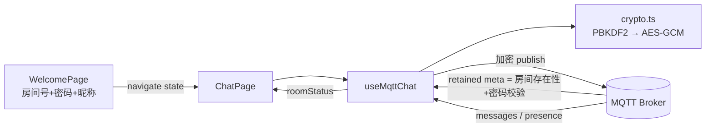

# 加密聊天室 —— 项目现状与需求基线

> 本文件是 AI 的项目上下文来源，描述**代码库的真实实现**。
> 上一次审计（见 `AUDIT.md`）发现本文件与实现严重脱节，已按实现重写。
> 修改代码后请同步更新本文件对应章节。

## 产品概述

- **产品类型**: 实时通讯应用（隐私优先的私密聊天室）
- **场景类型**: `<scene_type>prototype-app</scene_type>`
- **目标用户**: 需要小范围、非公开文字交流的用户（好友间临时群聊）
- **核心价值**: 房间号 + 房间密码即可开聊，消息端到端加密，无需注册账号
- **界面语言**: 中文
- **主题偏好**: 浅色（暖调珊瑚主色，简洁现代）
- **导航模式**: 无全局导航（三个页面通过路由切换）

**加入方式**：输入「聊天室 ID（纯数字，≤10 位）」+「房间密码（≥8 位）」+「昵称」。
相同 ID 且相同密码的用户进入同一房间。

---

## 技术架构

| 层 | 实现 |
|---|---|
| 传输 | MQTT over WSS（`mqtt` 包），单一公共 Broker，凭据由环境变量注入 |
| 加密 | PBKDF2-HMAC-SHA256 → AES-GCM-256，每条消息独立随机 12 字节 IV |
| 密钥派生版本 | v2 = 600,000 次迭代（新房间默认）；v1 = 100,000 次（兼容历史房间） |
| 状态管理 | React Hooks，全部聊天逻辑集中在 `src/hooks/useMqttChat.ts` |
| 路由 | react-router-dom（`BrowserRouter` 在 `index.tsx` 中配置） |
| 存储 | 昵称/房间号 → 平台 `scopedStorage`；密码 → `sessionStorage` |

### 数据流



关键设计：**`meta` topic 同时承担「房间存在性 + 密码校验 + 生命周期元信息」三重职责**，
因此它必须位于**与密码无关**的 topic 上（否则错误密码无法被识别）。

---

## 页面结构总览

| 页面名称 | 文件 | 路由 | 入口来源 |
|---------|------|------|---------|
| 欢迎页 | `src/pages/WelcomePage/WelcomePage.tsx` | `/` | 默认首页 |
| 聊天主界面 | `src/pages/ChatPage/ChatPage.tsx` | `/chat` | 欢迎页 → 提交表单后进入 |
| 404 | `src/pages/NotFoundPage/NotFoundPage.tsx` | `*` | 兜底 |

页面专属组件放在各页面的 `components/` 子目录下：

- `src/pages/WelcomePage/components/` → `WelcomeHeroSection.tsx`、`NicknameInputSection.tsx`
- `src/pages/ChatPage/components/` → `MessageListSection.tsx`、`ChatInputSection.tsx`、`OnlineUsersSection.tsx`
- `src/components/` 只保留 `Layout.tsx`（全局布局）与 `ui/`（shadcn 组件库）

---

## 数据来源声明

| 数据/操作 | 来源类型 | 实现要求 |
|---|---|---|
| 用户昵称 / 房间号 | local-persist | `scopedStorage`，欢迎页自动回填 |
| 房间密码 | session-persist | `sessionStorage`，刷新可恢复、关闭标签页失效 |
| Broker 连接信息 | build-env | `VITE_MQTT_URL` / `VITE_MQTT_USERNAME` / `VITE_MQTT_PASSWORD` |
| 消息收发 | real-api | MQTT publish/subscribe，AES-GCM 加密 |
| 在线用户列表 | real-api | presence topic：join / leave / heartbeat / request-users |
| 房间生命周期 | real-api | retained meta topic，默认 3 小时，支持手动与自动续期 |

**无 mock 兜底**：历史版本的 mock 数据（`src/data/chat.ts`）已随审计清理删除。

---

## 功能列表

### 欢迎页

- 房间号输入：仅数字，`maxLength=10`
- 密码输入：`minLength=8`、`maxLength=64`，支持明文/密文切换；
  密码强度不足时给出说明（密码直接决定加密强度）
- 昵称输入：`maxLength=20`
- 提交：按钮或 Enter；三项校验通过且已配置 Broker 时才可提交
- 错误回显：接收聊天页通过路由 state 传来的失败原因（密码错误 / 房间已销毁）
- 配置缺失：未配置环境变量时展示提示条并禁用提交

### 聊天主界面

- 顶栏：房间号、连接状态、剩余时间（紧迫时高亮 + 加时按钮）、在线用户头像条
- 消息列表：可滚动；自己的消息右对齐（primary 气泡），他人左对齐（muted 气泡）；
  系统消息居中；图片可点击放大；文件可点击下载
- 发送状态：自己的消息带 `sending` / `sent` / `failed` 三态，
  失败消息展示「点击重试」
- 新消息提示：不在底部时他人消息触发浮层；自己的消息则强制滚到底部
- 输入栏：Enter 发送；支持图片（自动压缩）与文件（≤700KB）；超限即时报错
- 响应式：桌面端顶栏显示在线用户，移动端改为独立横条（按断点单份挂载）
- 房间生命周期：剩余时间每秒刷新；剩余 <15 分钟高亮；支持手动加时（3 次，+24h/+3d/+7d）

---

## 本地存储

统一定义在 `src/lib/chatStorage.ts`：

| 键名 | 位置 | 说明 |
|---|---|---|
| `__global_chat_nickname` | scopedStorage | 上次使用的昵称 |
| `__global_chat_room_id` | scopedStorage | 上次进入的房间号 |
| `__global_chat_password` | sessionStorage | 房间密码（仅当前标签页） |

---

## 通信协议约定

### topic 布局

| 协议 | topic | 适用 |
|---|---|---|
| v1（历史兼容） | `chatroom/{roomId}/messages`、`.../presence` | 加密版本 v1 的既有房间 |
| v2（当前） | `chatroom/{roomId}/{topicNamespace}/messages`、`.../presence` | 新房间 |
| 通用 | `chatroom/{roomId}/meta` | retained 房间元信息（与密码无关，用于密码校验） |

`topicNamespace` 由房间密码经 PBKDF2 派生（8 字节 → hex），使无密码者无法通配订阅。
客户端启动时同时订阅 v1/v2 两组 topic，并在收到 meta 后按 `meta.proto` 决定收发方向。

### 信封格式

```ts
interface IEnvelope {
  v: number;    // 密钥派生版本，缺省视为 1
  iv: string;   // base64，12 字节随机
  data: string; // base64 密文
}
```

### 房间元信息（retained，加密）

```ts
interface IRoomMeta {
  createdAt: number;
  destroyAt: number;
  extendCount: number;      // 手动续期次数，上限 3
  autoExtendCount?: number; // 自动续期次数，上限 3
  creatorId: string;
  creatorName: string;
  version?: number;         // 单调递增（取 Date.now()），用于冲突收敛
  kdf?: number;             // 密钥派生版本
  proto?: number;           // 1 = 扁平 topic，2 = 带命名空间 topic
}
```

### presence 消息

`{ kind, userId, userName, sid, ts }`，`kind ∈ join | leave | heartbeat | request-users`。

MQTT 遗嘱（will）由 Broker 代发、**无法加密**，因此只携带
`sid = sha256(clientId).slice(0,16)`；接收方通过 presence 消息建立的
`sid → user` 映射还原离开者身份。

### 房间生命周期

- 创建即 3 小时；在线 ≥15 人时自动续期 3 小时（最多 3 次）
- 手动加时最多 3 次：+24 小时 / +3 天 / +7 天
- 到期且不满足自动续期条件时销毁：清除 retained meta 并提示房间已销毁
- 建房间前等待 retained meta 2–4 秒（含随机抖动），避免多客户端同时建房

---

## 安全模型与边界

**保证**
- 消息与元信息全程 AES-GCM 加密；每条消息独立随机 IV，不复用
- 房间密码只存在内存与 `sessionStorage`，不进入长期存储
- 仓库内不含任何 Broker 凭据（由环境变量注入）
- 消息渲染为纯文本插值，未使用 `dangerouslySetInnerHTML`

**明确不保证（无服务器、纯客户端方案的固有边界）**
- MQTT 凭据在浏览器端必然可见：请使用专用账号 + Broker ACL 限制 topic 范围
- 盐值只能确定性（所有成员需独立推导同一密钥），因此加密强度依赖密码强度；
  前端已强制 ≥8 位，但**不承诺抗有组织算力的口令爆破**
- `meta` topic 与密码无关，持凭据者可写入伪造报文；客户端已做到「房间激活后
  忽略无法解密的 meta，不踢人」，但彻底防护需依赖 Broker 的发布鉴权
- 不做消息历史持久化：新加入者看不到加入前的消息

---

## 环境变量与命令

| 变量 | 说明 |
|---|---|
| `VITE_MQTT_URL` | WSS 端点 |
| `VITE_MQTT_USERNAME` | Broker 用户名 |
| `VITE_MQTT_PASSWORD` | Broker 密码 |

复制 `.env.example` 为 `.env.local` 后填入（`.env.local` 已被 gitignore）。

| 命令 | 说明 |
|---|---|
| `npm run dev` | 开发服务器（端口 8001） |
| `npm run build` | 生产构建（`node scripts/build.mjs`，跨平台） |
| `npm run lint` | typecheck + eslint |

---

## UI 设计指南

### Art Direction

**Soft Pop 暖调社交** —— Rounded 圆润几何 + Warm Natural 自然暖调。
圆角 soft（`rounded-xl` ~ `rounded-2xl`）/ 阴影 subtle（`shadow-sm`）/
间距 spacious（`gap-4` ~ `gap-6`）/ 字体 Noto Sans SC。

### 色彩系统

| 角色 | CSS 变量 | HSL | 用途 |
|---|---|---|---|
| bg | `--background` | `hsl(30 20% 97%)` | 暖白页面底 |
| card | `--card` | `hsl(0 0% 100%)` | 卡片、他人气泡 |
| text | `--foreground` | `hsl(220 15% 20%)` | 标题与正文 |
| textMuted | `--muted-foreground` | `hsl(220 8% 55%)` | 时间戳、占位符 |
| primary | `--primary` | `hsl(6 78% 57%)` | 主按钮、自己的气泡、在线指示点 |
| accent | `--accent` | `hsl(6 60% 95%)` | hover / 选中反馈底 |
| border | `--border` | `hsl(30 10% 88%)` | 输入框、卡片、分隔线 |

**语义色（务必成对使用）**

| 场景 | 实心底 | 浅底（推荐） |
|---|---|---|
| 成功 / 在线 | `bg-success` + `text-success-foreground` | — |
| 警告 | `bg-warning` + `text-warning-foreground`（foreground 为近白色，**只能配实心底**） | `bg-warning-surface` + `text-warning-surface-foreground` + `border-warning-surface-border` |
| 错误 / 断连 | `bg-destructive` + `text-destructive-foreground` | `bg-destructive/10` + `text-destructive` |

> 反模式提示：`bg-warning/10 text-warning-foreground` 会造成约 1.1:1 的对比度
> （浅橙底 + 近白字），是最容易犯的错误，务必使用 `warning-surface-*`。

### 布局契约

- 聊天页内容区统一 `max-w-3xl mx-auto`（顶栏、消息列表、输入栏三者对齐）
- 欢迎页 `max-w-md mx-auto` 居中单卡片
- 消息列表独立滚动 `overflow-y-auto`，输入栏 `sticky bottom-0`
- 主色使用比例约 60% 中性 / 30% 辅助 / 10% primary

### 组件原则

- 欢迎页：输入框 `rounded-xl` + `border` + `focus-visible:ring-2`；按钮 primary 实心，禁用时灰显
- 聊天气泡：自己的 `bg-primary text-primary-foreground rounded-2xl rounded-br-md`；
  他人的 `bg-muted text-foreground rounded-2xl rounded-bl-md`；最大宽度 `max-w-[75%] md:max-w-[60%]`
- 在线用户：`overflow-x-auto` 横条 + 圆形首字母头像 + 绿色在线点
- 输入栏：`rounded-full` 输入框 + 圆形发送按钮，发送中显示旋转图标

### Anti-patterns

- 欢迎页与聊天页使用不同圆角 / 主色（全站共享同一套暖调系统）
- 使用不存在的 CSS 变量（编造 token）
- 回到默认蓝按钮或通用紫渐变
- `hover` 与 `active` 做了但丢失 `focus-visible`
- 把 primary 铺满所有图标、边框、链接（按 60-30-10 收敛）
- 语义色饱和度远高于主色（应保持在主色 ±15% 内）

---

## 已知约束（需后续决策）

1. **协议版本迁移**：v2（600k 迭代 + 命名空间 topic）为当前默认；旧版本客户端
   无法加入新建的 v2 房间（会提示「检测到更高版本的房间协议」）。
   历史 v1 房间仍受支持，但建议在低峰期整体切换。
2. **`src/components/ui/` 被 tsconfig 与 eslint 排除**：该目录不参与类型检查与
   静态检查，修改前请自行确认依赖存在。详见 `README.md`。
3. **Broker ACL 未配置**：`meta` topic 的写入鉴权依赖 Broker 侧配置，
   当前仅靠客户端容错（忽略无法解密的 meta）。
4. **无消息历史**：不持久化，新加入者看不到历史消息。
