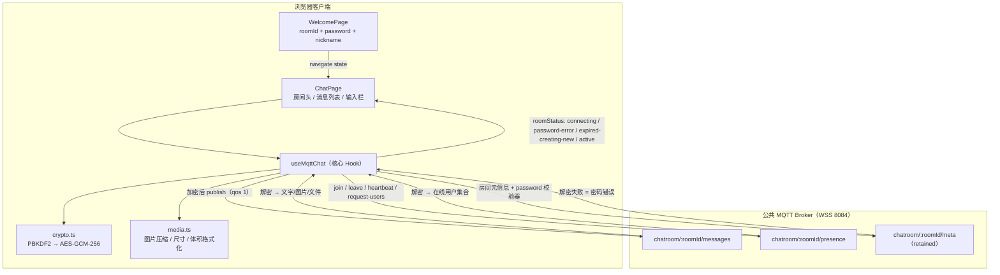

# Open Chat 项目审计报告

| 项目 | 内容 |
| --- | --- |
| 审计对象 | `Open Chat`（本地目录 `MTQQ`，仓库 `XXXoooM/Open-Chat`） |
| 审计日期 | 2026-09-23 |
| 审计类型 | 静态代码审计（全仓库、四维度） |
| 交付物 | 本报告（`AUDIT.md`），**不含任何代码改动** |
| 问题总数 | 44 项（P0 × 1、P1 × 9、P2 × 15、P3 × 19） |
| 总体结论 | 功能主干完整、E2EE 设计方向正确，但**存在 1 项 P0 级凭据泄露**、多处高概率功能失效与竞态；工程整洁度与文档一致性偏差较大 |

> **敏感值脱敏说明**：本报告引用源码中的硬编码凭据时已打码（原始明文位置见 `SEC-01`），避免报告本身造成二次泄露。

---

## 1. 执行摘要

### 1.1 项目真实形态

项目实际是一个**基于 MQTT over WSS 的端到端加密私密聊天室**，而非脚手架模板：

- 加入方式：**房间号（纯数字）+ 房间密码 + 昵称**（`NicknameInputSection.tsx:17-20`）
- 传输层：单一公共 MQTT Broker，三个 topic 复用（`useMqttChat.ts:93-95`）
  - `chatroom/{roomId}/messages` —— 文字 / 图片 / 文件（后两者「元信息 envelope + 二进制 envelope」同包发送）
  - `chatroom/{roomId}/presence` —— join / leave / heartbeat / request-users
  - `chatroom/{roomId}/meta` —— retained 房间元信息（创建时间、销毁时间、续期次数、创建者），同时承担**密码校验器**角色
- 加密：`PBKDF2(password, salt=f"chatroom-e2ee-v1-{roomId}", 100000) → AES-GCM-256`，每条消息独立随机 12 字节 IV（`crypto.ts:41-92`）
- 房间生命周期：创建即 3 小时，支持手动续期 3 次（+24h / +3d / +7d），在线 ≥15 人时自动续期 3 小时
- 在线状态：15s 心跳 + 30s 超时剔除（`useMqttChat.ts:49-50`）
- 传输限制：单包 ≤ 950KB，文件预检 ≤ 700KB，图片长边压至 1280px / JPEG 0.75

### 1.2 与 `AGENTS.md` 的偏差

`AGENTS.md`（`# 在线聊天室 - 需求拆解文档`）描述的是「**WebSocket** + 仅昵称 + mock 兜底 + 单一存储键」，与实现完全脱节（见 `ENG-05`）。**任何以 `AGENTS.md` 为准的后续开发都会跑偏**，建议优先修正该文档。

### 1.3 Top 风险（按处置优先级）

| # | 编号 | 风险 | 级别 |
| --- | --- | --- | --- |
| 1 | `SEC-01` | MQTT Broker 账号密码硬编码在客户端，随打包产物分发 | **P0** |
| 2 | `SEC-02` | 任意持凭据者发一条 `meta` 报文即可把房间内**全部用户踢回首页** | P1 |
| 3 | `SEC-03` | PBKDF2 盐仅由「固定前缀 + 短数字房间号」构成，离线爆破密码成本低 | P1 |
| 4 | `SEC-05` | topic 由可枚举的短数字 roomId 拼接 + Broker 凭据全局共享 → 可监听/冒名任意房间 | P1 |
| 5 | `FUNC-01` | 房间过期分支漏发 `request-users`，导致「≥15 人自动续期」**几乎不可达** | P1 |
| 6 | `FUNC-02` | 每次重连重复创建心跳/生命周期 `setInterval` 且不清理旧实例 | P1 |
| 7 | `FUNC-04` | 消息接收无 id 去重，QoS 1 重投递导致消息重复上屏 | P1 |
| 8 | `FUNC-05` | 密码错误 / 房间销毁的提示链路断裂，用户只看到「莫名被弹回首页」 | P1 |
| 9 | `FUNC-07` | 房间剩余时间倒计时被 `useMemo` 冻结，数字**完全不跳动** | P2 |
| 10 | `ENG-03` | 55 个 UI 组件中的 50 个、以及 10 个 npm 依赖从未被引用 | P2 |

### 1.4 做得好的部分（避免误伤）

- 加解密全部使用 WebCrypto 原生实现，**无自研密码学**；IV 每次随机且不复用（`crypto.ts:69-71`）
- 消息渲染路径**无 XSS 面**：未使用 `dangerouslySetInnerHTML`、未引入 markdown 渲染，`{msg.content}` 由 React 自动转义（`SEC-07` 已核查）
- 大二进制做了 950KB 硬闸 + 客户端图片压缩，避免了明显的 Broker 拒包
- `useCallback` / `useMemo` 覆盖较全，`MessageListSection` 已 `memo` 化（但存在 `FUNC-17` 的双份挂载浪费）
- 消息列表滚动、新消息提示、图片预览遮罩、ESC 关闭等交互细节完整

---

## 2. 审计范围与方法

### 2.1 审计范围

| 范围 | 明细 |
| --- | --- |
| 源码 | `src/`（76 个文件：67 `*.tsx`、6 `*.ts`、3 `*.css`） |
| 配置 | `package.json`、`vite.config.ts`、`tsconfig*.json`、`eslint.config.mjs`、`components.json`、`index.html` |
| 脚本 | `scripts/dev.mjs`、`scripts/build.sh`、`scripts/setup-git-hooks.mjs` |
| 文档 | `README.md`（实为「项目技术规范」）、`AGENTS.md`（实为「需求拆解文档」）、`shared/*/README.md` |
| 资产 | `public/`、`shared/static/`、`shared/capabilities/` |

**未纳入范围**：`node_modules`（不存在，依赖未安装）、`.codebuddy/`、`.spark/`、`.npmrc`、`package-lock.json` 细节、Broker 服务端配置与 EMQX 云端策略、平台 `@lark-apaapas` 运行时内部实现。

### 2.2 审计方法

1. **证据驱动三要素**：每条结论必须给出「精确定位（`文件:行号`）→ 原始代码片段 → 影响推导」，行号均取自当前文件实际内容。
2. **语义引用核验**：死代码、重复类型、未使用依赖的结论经 LSP `findReferences` / `workspaceSymbol` 复核，而非文本搜索推断。
3. **四维不重叠**：同一问题只在其主导维度成条，跨维度影响以「关联」标注，避免重复计数。
4. **架构基线固化**：以 2.3 的数据流图作为所有问题的共同参照。

### 2.3 真实架构与数据流



关键设计点：**`meta` 主题同时承担「房间存在性 + 密码校验 + 生命周期」三重职责**，且其本身是 retained（新订阅者立即收到）。这一耦合是 `SEC-02`、`SEC-06`、`FUNC-03` 的共同根因。

### 2.4 严重级别定义

| 级别 | 判定标准 |
| --- | --- |
| **P0** | 直接导致凭据/密钥泄露、消息不可达或房间不可用的阻断性问题 |
| **P1** | 高概率功能失效、隐私泄露、竞态导致状态不一致 |
| **P2** | 特定条件下出错、资源泄漏、体验/视觉缺陷、可维护性风险 |
| **P3** | 整洁度、规范符合度、一致性问题 |

### 2.5 未执行项（环境限制）

当前环境为 **win32 + PowerShell**，且：

- `node_modules` **不存在** → 依赖未安装，`npm run typecheck` / `lint` / `build` / `dev` 均无法执行，**本报告不含编译期与运行时验证结果**
- 无 `.git` 目录 → 非 git 仓库，`scripts/setup-git-hooks.mjs:11` 会静默跳过（不影响审计结论）

因此本报告全部结论均来自静态代码分析（含 LSP 语义引用核验）。所有需运行时确认的项已单列于第 7 章，不与已确证问题混列。

---

## 3. 安全问题

### SEC-01 【P0】MQTT Broker 凭据硬编码并随前端产物分发

**定位**：`src/hooks/useMqttChat.ts:48`、`435`、`440-441`

```ts
48:  const BROKER_URL = 'wss://<broker-host>:8084/mqtt';
435:      const client = mqtt.connect(BROKER_URL, {
440:        username: '<broker-username>',
441:        password: '<broker-password>',        // ← 原为明文硬编码
```

> 本报告全篇对 Broker 地址、账号与密码一并脱敏，仅保留「存在硬编码」这一事实与定位。

**影响**：这是整个安全模型的**单点失效**。MQTT 客户端凭据必须下发到浏览器才能建连，因此必然出现在打包产物（`dist`）中，任何人可通过 DevTools / 抓包 / 反混淆取得：

1. 直接连上 Broker，订阅 `chatroom/#` 通配符 → **旁路全部房间的密文流量**，为 `SEC-03` 的离线爆破提供弹药
2. 向任意 topic 发布伪造报文 → 触发 `SEC-02` 的全员踢线
3. 消耗 Broker 连接数/流量配额

> 注：E2EE 保证了「拿到凭据也无法直接读懂明文」，但凭据泄露把攻击面从「猜密码」降级为「拿密文离线爆破 + 无门槛 DoS」。

**修复方向**：凭据移出源码，改用构建期注入的环境变量（如 `import.meta.env.VITE_MQTT_USER`），并在 CI/平台密钥管理中保存；同时为该应用**单独签发专用的 Broker 账号与 ACL**（按 clientId 前缀限制可发布/订阅的 topic 范围），避免与其它应用共用同一个 Broker 账号。若 Broker 支持，进一步启用「按房间动态凭证」或改用平台自带的实时通信能力，彻底避免前端持有长期凭据。

---

### SEC-02 【P1】单条伪造 `meta` 报文即可将房间内全部用户踢回首页（无密码 DoS）

**定位**：`src/hooks/useMqttChat.ts:223-229`、`515-519`；`src/pages/ChatPage/ChatPage.tsx:63-65`

```ts
223:      const meta = await decryptJson<IRoomMeta>(key, envelope as { iv: string; data: string });
224:      if (!meta) {
225:        // 解密失败 = 密码错误
226:        setRoomStatus('password-error');
227:        setStatus('disconnected');
228:        onPasswordError?.();
229:        return;
```

```ts
63:  const handlePasswordError = useCallback(() => {
64:    navigate('/', { replace: true, state: { error: '密码错误' } });
```

**影响**：`meta` 主题**无任何发布鉴权**（凭据见 `SEC-01`）。攻击者只需向 `chatroom/{roomId}/meta` 发布一条 `{"v":1,"iv":"<任意>","data":"<任意>"}`，房间内所有在线客户端的解密即失败，被判定为「密码错误」并强制跳转首页。由于 roomId 为短数字（`NicknameInputSection.tsx:70-75` 限制为 `\D` 剔除后的 ≤10 位数字），可**批量遍历房间号**实现规模化骚扰。

附带后果：该路径会把连接状态置为 `disconnected` 并触发 `navigate`，用户侧表现为「莫名其妙被踢出且没有任何提示」（提示缺失见 `FUNC-05`）。

**修复方向**：
1. 「密码错误」判定必须与「meta 报文被篡改」区分 —— 仅在**本地首次拿到 retained meta 且解密失败**时才判定密码错误；房间已 `active` 后收到的 meta 若解密失败应**忽略并记录告警**，不做跳转。
2. 为 meta 增加完整性校验：在 envelope 中附带基于密钥的 MAC / 或在 meta 内加入房间号派生校验字段，使随机报文无法通过格式校验。
3. 引入「meta 版本号 + 单调递增」策略，拒绝版本倒退或异常的 meta 覆盖。

---

### SEC-03 【P1】密钥派生盐值强度不足，短房间号使离线爆破可行

**定位**：`src/lib/crypto.ts:42-43`、`54-65`

```ts
42:  const saltStr = `chatroom-e2ee-v1-${roomId}`;
...
58:      iterations: 100000,
62:    { name: 'AES-GCM', length: 256 },
```

**影响**：PBKDF2-HMAC-SHA256 迭代 10 万次在现代 GPU 上约可尝试 10⁴–10⁵ 次/秒（单卡）。而：

- **salt 完全可预测**：仅由固定前缀 + roomId 组成，而 roomId 是「纯数字、≤10 位」，实际使用中更可能是 4–6 位（`NicknameInputSection.tsx:70-75` 甚至主动把非数字字符剔除）
- **密文可直接获取**：`meta` 是 retained 报文，任意持凭据者订阅即得，无需交互
- 房间密码是用户自选的短口令（`maxLength=64`，但无最小强度约束）

三者叠加使「离线字典/暴力破解房间密码 → 解密全部历史流量」成为现实可行的攻击路径，**直接削弱 E2EE 的核心承诺**。

**修复方向**：
1. 提高派生成本：迭代次数提升至 600,000+，或直接改用 `Argon2id` / `scrypt`（若引入 WASM 依赖可接受）
2. salt 改为「随机值 + 随 meta 一起分发」或至少拼接 `roomId + 创建时间戳`，避免全局固定前缀可预计算
3. 在前端对房间密码施加强度校验（长度 ≥ 8、拒绝纯数字/常见口令），并在 UI 上明确告知「密码强度决定聊天内容安全」
4. 明确文档化：该方案为「基于口令的端到端加密」，不承诺抗有组织算力的密码破解

---

### SEC-04 【P1】`will` 遗嘱以明文发送，泄露昵称与客户端 ID（且功能同时失效）

**定位**：`src/hooks/useMqttChat.ts:442-453`（明文构造）、`524-525`（接收侧丢弃）

```ts
442:        will: {
444:          payload: JSON.stringify({
445:            // 遗嘱暂时发明文，先建连后等密钥派生
446:            kind: 'leave',
447:            userId: clientIdRef.current,
448:            userName: nickname,
449:            ts: Date.now(),
450:          }),
451:          qos: 1,
452:          retain: false,
```

```ts
524:          if (topic === topicPresence) {
525:            if (!data.iv || !data.data) return;   // ← 明文遗嘱无 iv/data，被静默丢弃
```

**影响（双向）**：

1. **隐私泄露**：遗嘱由 Broker 代发，报文在 `presence` topic 上**不经过加密**，昵称与 `userId`（`user_{timestamp}_{random}`）以明文暴露给 Broker 及任何订阅该 topic 的第三方（参见 `SEC-01`/`SEC-05`）。
2. **功能失效**：接收侧强制要求 `data.iv && data.data`，明文遗嘱**必然被 `return` 静默丢弃**，因此「用户异常断线（未走清理函数）时的离开通知」实际永远不会生效 —— 只能依赖 30 秒心跳超时兜底。

**修复方向**：将遗嘱改为加密 payload 不可行（Broker 代发时客户端已死）。可行方案：
- 方案 A（推荐）：放弃遗嘱做业务通知，仅保留心跳超时剔除（`PRESENCE_TIMEOUT`），遗嘱 payload 置为**不含任何身份信息**的哨兵值或直接移除 `will` 配置
- 方案 B：遗嘱只携带**不可逆哈希**（如 `hash(clientId + roomId)`），接收侧据此匹配在线列表，既不泄露明文也不影响功能
- 无论哪种，都应同步修正 `524-525` 的接收判定，避免「合法报文被静默丢弃」这类问题再次发生

---

### SEC-05 【P1】topic 命名可枚举 + Broker 凭据全局共享 → 任意房间可被监听与冒名

**定位**：`src/hooks/useMqttChat.ts:93-95`；`src/components/NicknameInputSection.tsx:67-79`

```ts
93:  const topicMessages = `chatroom/${roomId}/messages`;
94:  const topicPresence = `chatroom/${roomId}/presence`;
95:  const topicMeta = `chatroom/${roomId}/meta`;
```

```ts
72:          onChange={(e) => setRoomId(e.target.value.replace(/\D/g, ''))}
70:          inputMode="numeric"
75:          maxLength={10}
```

**影响**：topic 命名空间完全由「短数字 roomId」决定，**无任何随机性/不可猜测性**。结合 `SEC-01`（凭据可提取）：

- 订阅 `chatroom/+/messages` 即可在**不解密**的前提下测绘「哪些房间存在、消息频率、活跃时段」（流量分析）
- 向 `chatroom/{任意 roomId}/messages` 发布报文，在房间内形成**伪造消息**（明文不可读，但会在 UI 上出现无法解密的空占位 / 干扰气泡）
- 与 `SEC-02` 组合可对任意房间实施定向踢线

**修复方向**：
1. topic 中加入**由房间密码派生的不可猜测标识**，例如 `chatroom/{roomId}/{roomKeyHash}/messages`，使无密码者无法定位 topic
2. 配合 Broker ACL，按客户端前缀限制可访问的 topic 范围（见 `SEC-01`）
3. 增强房间号熵：允许字母数字混合的房间号（但需同步 `SEC-03` 的 salt 策略与该输入校验）

---

### SEC-06 【P2】retained `meta` 可被任意持凭据者清空或伪造

**定位**：`src/hooks/useMqttChat.ts:318-319`、`392-393`

```ts
318:    // 先清除旧 retained（发空 retained 消息）
319:    clientRef.current?.publish(topicMeta, '', { qos: 1, retain: true });
...
392:          // 清除 retained meta
393:          clientRef.current?.publish(topicMeta, '', { qos: 1, retain: true });
```

**影响**：清空 retained 是应用的**正常业务流程**（重建房间、房间销毁），但该能力对任何持凭据者开放：

- 清空后，新进入者将在 `META_WAIT_MS`（2 秒）后判定「我是创建者」并 `createNewRoom()` → 房间密码被绕过重设，**原有房间被静默劫持**
- 结合 `SEC-02`，攻击者可将「踢线」与「房间重建」组合为持续骚扰

**修复方向**：与 `SEC-02` 同源治理 —— meta 的写入需具备可信来源校验（版本单调 + 创建者签名 + 仅创建者可清除）。至少应让「清除 retained」只在**房间销毁**路径触发，且清除后立即发布带撤销标记的新 meta，避免被误判为「无房间」。

---

### SEC-07 【P3】XSS / 注入面核查结论：当前无实际可利用面

**核查位置**：`src/components/MessageListSection.tsx:1-275`、`src/components/ChatInputSection.tsx`、`src/components/NicknameInputSection.tsx`

**结论（已核查，非缺陷）**：

- 全项目**无** `dangerouslySetInnerHTML`、无 `eval` / `new Function` / `innerHTML` 赋值
- 消息内容以 `{msg.content}` 纯文本插值渲染（`MessageListSection.tsx:148`），由 React 自动转义
- 未引入 `react-markdown` / `remark-gfm`（虽在 `package.json` 中声明但**从未被 import**，见 `ENG-03`），因此不存在 markdown → HTML 的注入链
- 唯一存在 `dangerouslySetInnerHTML` 的是 `src/components/ui/chart.tsx:83`，但该组件**不在聊天渲染路径上**，且其依赖 `recharts` 未被业务引用

**关联风险（需前瞻性提示）**：一旦未来为消息气泡增加「markdown 渲染」或「链接自动识别」，必须同步引入 HTML 消毒（如 DOMPurify）并对 `href` 做 `javascript:` 协议白名单过滤。当前 `imageName` / `fileName` 直接用于 `alt` 与展示文本，React 转义已足够，但若改为下载链路需注意文件名注入。

---

## 4. 功能正确性问题

### FUNC-01 【P1】房间过期分支漏发 `request-users`，导致「≥15 人自动续期」几乎不可达

**定位**：`src/hooks/useMqttChat.ts:255-291`（关键行 `259`、`261`）

```ts
255:      } else {
256:        // 房间已过期
257:        setRoomStatus('expired-creating-new');
258:        // 等 3 秒收集 presence，看是否有 ≥15 人
259:        setTimeout(() => {
260:          if (destroyedRef.current) return;
261:          const currentOnline = presenceTimersRef.current.size + 1; // 加上自己
262:          if (currentOnline >= AUTO_EXTEND_THRESHOLD) {
```

**对比**：正常进入分支（`238-254`）会主动发布 `request-users` 来采集在线用户：

```ts
248:        // 请求在线列表
249:        publishEncrypted(topicPresence, {
250:          kind: 'request-users',
```

**影响**：`presenceTimersRef` 只由「收到他人 `heartbeat`」填充（`192-198`）。在过期分支中既不发送 `request-users`，3 秒窗口内又不可能等到他人 15 秒周期的心跳，因此 `presenceTimersRef.size` 几乎恒为 0 → `currentOnline` 恒为 1 → **`AUTO_EXTEND_THRESHOLD`（15）分支不可达**，所有过期房间都会直接走 `createNewRoom()`，房间号/密码被重置。

**修复方向**：在过期分支的 3 秒等待前，先发布一次 `request-users`（并等待应答），或改为**基于 heartbeat 时间戳集合**统计在线人数（记录每个 userId 的最后心跳时间，统计窗口内活跃者），把判定窗口放宽到 `PRESENCE_TIMEOUT` 量级。

---

### FUNC-02 【P1】重连时重复创建心跳与生命周期定时器，旧实例未清理（定时器泄漏）

**定位**：`src/hooks/useMqttChat.ts:484-493`、`496`（创建）；`666-668`（清理）

```ts
484:        heartbeatRef.current = setInterval(() => {
...
493:        }, HEARTBEAT_INTERVAL);
...
496:        scheduleLifecycleCheck();
```

```ts
666:      if (heartbeatRef.current) clearInterval(heartbeatRef.current);
667:      if (lifecycleTimerRef.current) clearTimeout(lifecycleTimerRef.current);
668:      if (metaTimerRef.current) clearTimeout(metaTimerRef.current);
```

**影响**：`client.on('connect')` 在**每次重连（`reconnectPeriod: 3000`）后都会再次触发**。此时 `heartbeatRef.current` 被新 interval 覆盖，但**旧 interval 从未 `clearInterval`**，导致：

- 心跳以 15s×N 的频率叠加发送（N = 重连次数），挤占 Broker 配额、放大 presence 噪声
- `scheduleLifecycleCheck()`（`365-401`）同理叠加，房间生命周期判定被多次并发执行 —— 与 `FUNC-03` 叠加后可能触发重复续期或重复销毁
- `src/index.tsx:10` 的 `<StrictMode>` 在开发态会 mount→unmount→mount，进一步放大该现象（生产环境不双跑，但泄漏仍在）

**修复方向**：在创建前先清理旧实例（`if (heartbeatRef.current) clearInterval(heartbeatRef.current)`），并把「注册监听器 + 启动定时器」的副作用集中到一个 `startTimers()` 函数中，在 `connect`、`reconnect`、`close` 三个事件上做幂等的启停管理。

---

### FUNC-03 【P1】「2 秒收不到 meta 就建新房间」存在多客户端竞态

**定位**：`src/hooks/useMqttChat.ts:473-479`（判定）与 `305-333`（建造）

```ts
474:            metaTimerRef.current = setTimeout(() => {
475:              if (!metaReceivedRef.current && !destroyedRef.current) {
476:                // 2 秒没收到 meta，我是创建者
477:                createNewRoom();
478:              }
479:            }, META_WAIT_MS);
```

```ts
318:    // 先清除旧 retained（发空 retained 消息）
319:    clientRef.current?.publish(topicMeta, '', { qos: 1, retain: true });
322:    setTimeout(() => {
323:      publishEncrypted(topicMeta, newMeta, { qos: 1, retain: true });
```

**影响**：`META_WAIT_MS` 固定 2 秒，且判定条件是「**我没收到**」而非「**确实不存在**」。当两个用户同时首次进入同一房间号（网络稍慢、冷启动稍慢）时：

1. A、B 各自在 2 秒后判定自己是创建者 → 各自 `createNewRoom()`
2. 双方都先发空 retained 再发新 meta → **后写覆盖前写**
3. 结果：A 的 `metaRef` 与 Broker 上的 retained meta 不一致，`destroyAt` / `creatorId` 分歧；后续 `extendRoom` 基于**本地 meta** 计算并覆盖 retained（`349-357`），进一步放大分歧

对「新房间同时被多人首次进入」这一**极常见**场景，属于高概率缺陷。

**修复方向**：
1. 引入「创建者竞选」：发布 `create-intent` 后随机退避（如 `1000 + rand(1500) ms`）再检查 meta 是否已存在，降低撞车概率
2. meta 增加 `version`（单调递增）与 `creatorId`，**只接受版本更高的 meta**，冲突时以 Broker retained 为准并丢弃本地 meta
3. 延长 `META_WAIT_MS` 并对「已订阅但未收到」与「retained 为空」两种情况进行区分处理

---

### FUNC-04 【P1】消息接收无 id 去重，QoS 1 重投递会重复上屏

**定位**：`src/hooks/useMqttChat.ts:599`、`613`、`636`

```ts
636:              setMessages((prev) => [...prev, msg]);
```

**影响**：三个接收分支（图片 / 文件 / 文字）均为无条件 `append`，未校验 `msg.id` 是否已存在。MQTT QoS 1 的语义是「**至少一次**」，在 Broker 重传、客户端重连后补投、订阅重叠（同一 clientId 多次订阅）等情况下会产生重复投递 → 同一条消息在 UI 上出现多次。

开发态 `<StrictMode>` 双跑、以及 `FUNC-02` 的重复订阅叠加后，重复概率进一步升高。

**修复方向**：统一封装 `appendMessage(msg)`，内部以 `id` 为键做去重（`Set` 或 `prev.some(m => m.id === msg.id)`），并按 `timestamp` 插入排序（重连补投的历史消息应插到正确位置，而非一律追加到末尾）。

---

### FUNC-05 【P1】错误反馈链路断裂：密码错误 / 房间销毁的提示从未被消费

**定位**：`src/pages/ChatPage/ChatPage.tsx:63-71`（发送方）与 `src/pages/WelcomePage/WelcomePage.tsx:1-17`、`src/components/NicknameInputSection.tsx:1-161`（接收方）

```ts
63:  const handlePasswordError = useCallback(() => {
64:    navigate('/', { replace: true, state: { error: '密码错误' } });
65:  }, [navigate]);
...
67:  const handleRoomDestroyed = useCallback(() => {
69:      navigate('/', { replace: true, state: { error: '房间已销毁' } });
```

**核验结论**：`WelcomePage.tsx` 与 `NicknameInputSection.tsx` **全文均无 `useLocation`**（LSP 与全文检索均确认，`location.state.error` 在整个 Welcome 侧零消费）。

**影响**：用户输错密码 → 被静默弹回首页，**看不到任何原因**；房间到期销毁 → 同样静默弹回。这是用户可感知度最高的一类缺陷（「为什么我进不去？」），且会显著增加无效重试。

**修复方向**：`NicknameInputSection` 中读取 `useLocation().state?.error`，以 `toast.error(...)` 或表单顶部内联 Alert 展示；展示后调用 `navigate(location.pathname, { replace: true, state: null })` 清除 state，避免刷新后重复提示。同时建议在密码错误时保留用户已填写的 roomId/昵称（当前 `scopedStorage` 已持久化，但密码需重填，应给出明确指引）。

---

### FUNC-06 【P2】刷新 `/chat` 即丢失房间密码，被强制重定向回首页

**定位**：`src/pages/ChatPage/ChatPage.tsx:52`、`57-61`

```ts
52:  const password = state?.password || '';
...
58:    if (!nickname || !roomId || !password) {
59:      navigate('/', { replace: true });
```

**影响**：`roomId` 与 `nickname` 通过 `scopedStorage` 持久化（`ChatPage.tsx:50-51`），但**密码只存在于 `location.state`**。因此：

- 用户刷新页面（或从收藏夹/后退进入 `/chat`）→ 立即被弹回首页
- 网络中断后浏览器自动刷新、移动端切后台被回收 → 同样被踢出
- 而「重新进入」需要**再次手动输入密码**（`NicknameInputSection.tsx:18` 的 `password` 初始值为 `''`）

对聊天室这种「长时间驻留」场景，体验损失明显。

**修复方向**（安全与体验权衡，二选一）：
- **方案 A（推荐）**：不持久化密码，但刷新后停留在 `/chat` 并展示「请输入房间密码以重新连接」的居中卡片，密码提交后继续，避免直接踢回首页
- **方案 B**：将密码存入 `sessionStorage`（仅当前标签页生命周期，关闭即失效），刷新可恢复，同时明确说明其安全边界

---

### FUNC-07 【P2】房间剩余时间倒计时被 `useMemo` 冻结，数字完全不跳动

**定位**：`src/pages/ChatPage/ChatPage.tsx:54`、`92-103`

```ts
54:  const [, forceTick] = useState(0);
...
92:  useEffect(() => {
93:    if (!roomMeta) return;
94:    const timer = setInterval(() => forceTick((t) => t + 1), 1000);
...
98:  const remaining = useMemo(() => {
99:    if (!roomMeta) return null;
100:    return roomMeta.destroyAt - Date.now();
101:  }, [roomMeta]);
103:  const remainingInfo = remaining != null ? formatRemaining(remaining) : null;
```

**影响**：每秒 `forceTick` 确实触发了组件重渲染，但 `remaining` 的依赖数组为 `[roomMeta]` —— `roomMeta` 不变则 memo 值不变，因此 `remaining` 永远是**首次计算时的那个固定值**，`formatRemaining` 每秒都在格式化同一个数字。表现上：顶部「剩余 X小时YY分」永久静止，`< 15 分钟` 的 urgent 高亮、以及 `< 1 小时` 的「房间将在 X分YY秒 后销毁」**永远不会触发**。

这使 `ChatPage` 的整个倒计时与紧急态 UI 形同虚设（`remainingInfo.isUrgent` 决定的两处警告条 `209-231`、`239-257` 均依赖它）。

**修复方向**：把 `forceTick` 纳入依赖（`}, [roomMeta, tick]`），或更彻底地改为独立计时组件（`useRemainingTime(destroyAt)` 内部自持 `useState(Date.now())` 每秒更新），让倒计时状态局部化，顺带消除「每秒全页重渲染」的性能浪费。

---

### FUNC-08 【P2】离开用户未清理对应的 presence 计时器

**定位**：`src/hooks/useMqttChat.ts:178-183`

```ts
178:      case 'leave':
179:        setOnlineUsers((prev) => prev.filter((u) => u.id !== user.id));
180:        if (user.id !== clientIdRef.current) {
181:          toast.info(`${user.nickname} 离开了聊天室`);
182:        }
183:        break;
```

**影响**：`heartbeat` 分支（`185-199`）会为每个用户登记一个 30 秒超时计时器并存入 `presenceTimersRef`。用户**正常离开**（发送 leave）时，列表项被移除但**计时器与 map 条目未清理**：

- 残留计时器在 30 秒后触发一次无效的 `setOnlineUsers`（`prev` 中已无该用户，`filter` 为恒等操作 → 返回**新数组**，仍会触发一次无谓重渲染）
- map 条目持续泄漏（用户反复进出会累积）；更隐蔽的是，`presenceTimersRef.current.size` 被 `FUNC-01` 用作「在线人数」的估算依据，残留条目会**虚增人数**

**修复方向**：`leave`（以及 `join` 覆盖同一 userId 时）先 `clearTimeout` 并 `delete` map 条目，再更新列表；建议把「用户 → 计时器」的增删封装为 `trackPresence(userId)` / `untrackPresence(userId)` 一对函数，避免遗漏。

---

### FUNC-09 【P2】未连接时 `publishEncrypted` 静默返回，发送失败无任何反馈

**定位**：`src/hooks/useMqttChat.ts:118`（静默失败）；`705-723`（`sendMessage` 不检查返回值）

```ts
118:      if (!key || !client?.connected) return;
```

```ts
711:      const msgId = `msg_${++msgIdCounter}_${Date.now()}`;
712:      await publishEncrypted(topicMessages, {
```

**影响**：`publishEncrypted` 在「未连接 / 密钥未就绪」时**直接 return（void）**，调用方无法区分「已发送」与「丢弃」。表现为：

- 输入框在 `status !== 'connected'` 时已被禁用（`ChatPage.tsx:280`），但 **`status === 'connected'` 而 `connected` 事件与 client 状态短暂不一致**、或 `client.publish` 因回调失败时，消息会**静默丢失**，用户输入框已清空（`ChatInputSection.tsx:44`），看起来「发送成功」
- 自身消息依赖 Broker 回显才上屏（无本地乐观插入），因此丢包时用户会认为「消息没上屏 = 我没发出去」而重复发送，叠加 `FUNC-04` 的无去重又可能造成重复

**修复方向**：
1. `publishEncrypted` 返回 `Promise<boolean>`，`client.publish` 使用带回调的形式捕获投递结果
2. 发送失败时 `toast.error` 提示并**恢复输入框内容**（不清空）
3. 采用**乐观插入**：本地立即上屏（`pending` 状态），收到回显后按 `id` 去重并标记为已确认；超时未确认则标记失败 —— 这同时是 `FUNC-04` 去重机制的天然实现位置

---

### FUNC-10 【P2】`scrollToBottom(smooth)` 参数被忽略，平滑滚动永远不生效

**定位**：`src/components/MessageListSection.tsx:52-56`

```ts
52:  const scrollToBottom = useCallback((smooth = true) => {
53:    bottomRef.current?.scrollIntoView({ behavior: smooth ? 'auto' : 'auto' });
54:    setHasNewMessage(false);
55:    setIsAtBottom(true);
56:  }, []);
```

**影响**：三元表达式的两个分支**都是 `'auto'`**，`smooth` 参数完全无效 —— 这显然是书写疏漏（应为 `smooth ? 'smooth' : 'auto'`）。后果：点击「新消息」浮层（`227`）时本应平滑滚动，实际是瞬间跳转，动效体验缺失，也与设计规范中「动效精致」的取向不符。

**修复方向**：修正为 `behavior: smooth ? 'smooth' : 'auto'`；并注意「消息到达时自动置底」应使用 `'auto'`（避免连续平滑滚动排队），仅用户主动点击时使用 `'smooth'`。

---

### FUNC-11 【P2】自己发送的消息也会误触发「新消息」浮层

**定位**：`src/components/MessageListSection.tsx:68-74`

```ts
68:  useEffect(() => {
69:    if (isAtBottom) {
70:      scrollToBottom(false);
71:    } else if (messages.length > 0) {
72:      setHasNewMessage(true);
73:    }
74:  }, [messages.length, isAtBottom, scrollToBottom]);
```

**影响**：该 effect 只判断「消息数量变化」，不区分消息来源。用户在**向上翻阅历史**时发送一条消息，同样会弹出「新消息」提示按钮 —— 而这条消息正是用户自己发的，语义错误；且 `scrollToBottom` 未被调用（因为 `isAtBottom === false`），用户会困惑「我的消息去哪了」。

此外，依赖 `messages.length` 而非 `messages`，在同长度替换（如 `FUNC-09` 引入的 pending → confirmed 状态变更）场景下不会重新触发。

**修复方向**：
1. 记录上一次的 `messages` 引用/最后一条消息，判断新增消息是否为 `isMine`；`isMine` 时**强制滚到底部**并清空提示
2. 依赖改为 `messages`，并在比较时使用最后一条消息的 `id` 判断是否真的有新增

---

### FUNC-12 【P2】图片路径 `URL.createObjectURL` 泄漏

**定位**：`src/lib/media.ts:55`、`65`、`68`

```ts
55:    img.src = URL.createObjectURL(file);        // 压缩路径：onload 成功后未 revoke
...
65:      URL.revokeObjectURL(img.src);              // 仅 getImageDimensions 的成功分支 revoke
...
68:    img.src = URL.createObjectURL(file);          // getImageDimensions 的 onerror 分支未 revoke
```

**影响**：

- `compressImage`**每次调用都会泄漏一个 objectURL**（无论成功或失败），blob 会被浏览器持有直到页面卸载。用户连续发送图片（尤其大图）会造成内存持续增长
- `getImageDimensions` 仅在 `onload` 成功时 revoke（`65`），`onerror`（`67-68`）路径泄漏

**修复方向**：统一改为 `try/finally` 或 `const url = URL.createObjectURL(file)` + 在 `onload`/`onerror` **两个分支都** `URL.revokeObjectURL(url)`；注意不能在 `img.src` 赋值前 revoke。同时建议对 `compressImage` 的输出加一次字节数校验（见 `FUNC-15`）。

---

### FUNC-13 【P3】`lastExtendToastRef` 是恒为 `false` 的空守卫

**定位**：`src/pages/ChatPage/ChatPage.tsx:55`、`107-110`

```ts
55:  const lastExtendToastRef = useRef(false);
...
107:  const handleExtend = () => {
108:    if (!canExtend || lastExtendToastRef.current) return;
109:    extendRoom();
110:  };
```

**影响**：该 ref 全文件只有「声明 + 读取」，**从无赋值**，因此 `lastExtendToastRef.current` 恒为 `false`，守卫条件等价于 `!canExtend`。从命名看，原意应是「防止重复点击加时后重复弹提示」，属未完成实现（残留占位）。

**修复方向**：补全防重逻辑（在 `extendRoom()` 成功后置 `true`，或在 `extendRoom` 返回 `false` 时给出 `toast` 提示），或直接移除该死代码。

---

### FUNC-14 【P3】`extendCount` 语义不严格，生命周期上限可被绕过；`onRoomExpired` 为死配置

**定位**：`src/hooks/useMqttChat.ts:65`（声明未用）、`267`、`338`、`382`

```ts
65:  onRoomExpired?: () => void;      // 接口声明
...
338:    if (!meta || meta.extendCount >= 3) return false;   // 手动续期上限 3
...
267:              extendCount: meta.extendCount,             // 自动续期不递增
382:            extendCount: meta.extendCount,               // 自动续期不递增
```

**影响**：

1. **`onRoomExpired` 从未被解构使用**（hook 的 `69-75` 未取该字段，全文无引用）→ 死配置，误导调用方以为可感知「房间过期」事件
2. **续期语义不一致**：自动续期（≥15 人）延长 3 小时但**不递增 `extendCount`**，而手动续期上限是 `extendCount >= 3`。两者叠加的结果是：一个高活跃房间可在`extendCount === 0` 状态下被无限次自动续期（每次 3 小时），与「房间最多存活 3h + 24h + 3d + 7d」的设计意图不符；同时 `extendRoom` 的提示文案（`358-360`）基于 `extendCount` 推导时长，可能与实际生效的续期来源不一致
3. `RoomStatus` 含 `'expired-creating-new'`（`42-46`）但该状态**无法从 UI 侧区分**是否为自动续期成功

**修复方向**：明确生命周期模型 —— 建议区分 `manualExtendCount` 与 `autoExtendCount` 两个字段，并规定总存活上限（如自动续期最多 N 次）；为 `onRoomExpired` 补上调用点或从接口中删除。

---

### FUNC-15 【P3】700KB 阈值与预检逻辑双份重复，文案与级别不一致；图片路径无预检且 GIF 不压缩

**定位**：`src/components/ChatInputSection.tsx:15-16`、`79-82`；`src/hooks/useMqttChat.ts:52-53`、`790-793`；`src/lib/media.ts:6-8`；`useMqttChat.ts:155-157`、`770`

```ts
// ChatInputSection.tsx
15: const MAX_PAYLOAD_BYTES = 950 * 1024; // 950KB
16: const MAX_FILE_PRECHECK = 700 * 1024; // 700KB
...
79:    if (file.size > MAX_FILE_PRECHECK) {
80:      toast(`文件过大，无法发送（最大约 ${formatFileSize(MAX_FILE_PRECHECK)}）`);
```

```ts
// useMqttChat.ts
52: const MAX_PAYLOAD_BYTES = 950 * 1024;
53: const MAX_FILE_PRECHECK = 700 * 1024;
...
790:      if (file.size > MAX_FILE_PRECHECK) {
791:        toast.error('文件过大，无法发送（最大约 700KB）');
```

**问题点**：

1. **常量重复定义**两处，任何一侧调整都会失同步；`MAX_PAYLOAD_BYTES` 在 `ChatInputSection` 中定义但**从未使用**（该组件只用到 `MAX_FILE_PRECHECK`）
2. **同一失败场景的提示不一致**：一处用 `toast(...)`（默认级），一处用 `toast.error(...)`；文案一处动态格式化、一处硬编码 `700KB`
3. **图片路径无预检**：`ChatInputSection.tsx:57-72` 处理图片时**不做体积检查**，而 `media.ts:6-8` 对 GIF **跳过压缩**（原样返回字节）。因此一张 > 950KB 的 GIF 会走到 `publishBinaryMessage` 才被拒绝（`useMqttChat.ts:155-157` → `770` 的「图片过大，无法发送」），用户先经历「处理中...」临时消息（`732-742`）再看到失败，反馈链路明显偏长

**修复方向**：把 `MAX_PAYLOAD_BYTES` / `MAX_FILE_PRECHECK` 抽到 `src/lib/` 下的共享常量模块，`ChatInputSection` 与 `useMqttChat` 共同引用；图片路径增加与文件一致的预检（GIF 单独提示「动图不支持压缩，请控制在 700KB 内」）；统一失败提示的级别与文案。

---

### FUNC-16 【P3】以昵称判定「我」，重名用户会被同时标记

**定位**：`src/components/OnlineUsersSection.tsx:26`（排序逻辑见 `14-19`）

```ts
26:        const isMe = user.nickname === currentNickname;
```

**影响**：昵称**不唯一**（`NicknameInputSection.tsx:144` 仅限制 `maxLength=20`，无唯一性校验）。房间内出现同名用户时：

- 两个头像都会被加上 `ring-primary/40` 高亮并 title 显示「(我)」
- 排序中两人都会被优先置顶（`15-16`）

同理，`MessageListSection.tsx:136` 的 `msg.isMine ? '我' : msg.nickname` 依赖服务端下发的 `senderId` 比对（`isMine: meta.senderId === clientIdRef.current`），消息气泡本身是准确的 —— 说明**消息侧已有可靠的 id 判定，在线列表侧应与之对齐**。

**修复方向**：`OnlineUsersSection` 改为接收 `currentUserId`（即 `clientIdRef` 对应的 id）而非 `currentNickname`，用 id 比对；`ChatPage.tsx:234/262` 的传参同步调整（需要 `useMqttChat` 额外导出 `clientId`）。

---

### FUNC-17 【P3】`OnlineUsersSection` 被同时挂载两份（桌面 + 移动），头像列表重复渲染

**定位**：`src/pages/ChatPage/ChatPage.tsx:233-235`、`261-263`

```ts
233:          <div className="hidden sm:block">
234:            <OnlineUsersSection users={onlineUsers} currentNickname={nickname} />
...
261:      <div className="sm:hidden border-b border-border/30 bg-muted/30 px-4 py-2 overflow-x-auto">
262:        <OnlineUsersSection users={onlineUsers} currentNickname={nickname} />
```

**影响**：两处均使用 CSS（`hidden sm:block` / `sm:hidden`）做响应式切换，**两个组件实例始终同时挂载**。每个实例内部都有一份 `useMemo` 排序 + N 个 `motion.div`（`OnlineUsersSection.tsx:28-43`，每人一个动画节点）。房间里 50 人时，等于**渲染 100 个头像节点**，其中一半永不展示；同时 `framer-motion` 的入场动画在隐藏树上也会执行。

**修复方向**：改用 `useIsMobile()`（`src/hooks/use-mobile.ts`，已存在但当前仅被被排除的 `ui/sidebar.tsx` 引用）做条件渲染，只挂载当前断点需要的那一份；或统一为一份、用容器类控制布局差异。

---

### FUNC-18 【P3】发送中状态用 `X` 图标表示，语义与可操作性都不对

**定位**：`src/components/ChatInputSection.tsx:148-160`

```ts
155:          {sending ? (
156:            <X className="h-4 w-4" />
157:          ) : (
158:            <Send className="h-4 w-4" />
159:          )}
```

**影响**：`X` 在 UI 语义上表示「取消/关闭」，但该按钮此刻是 `disabled`（`151`：`disabled={!canSend}`，而 `canSend` 包含 `!sending`），点击无任何反应 → **图标暗示可取消，实际不可点**，属误导性交互。同时整个发送期间输入框与「+」菜单均被禁用（`119`、`144`），但在传大文件（加密 + Base64 编码可达数百毫秒到数秒）时没有任何进度提示，仅有一个静止的 `X`。

**修复方向**：改用 `Loader2`（`lucide-react`）并加 `animate-spin`；或引入进度反馈（文件上传/加密进度）。若确实希望支持取消，需提供 `AbortController` 并让按钮变为可点击的取消态。

---

## 5. UI 与主题一致性问题

### UI-01 【P2】警告态「浅底 + 近白字」，对比度严重不足

**定位**：`src/pages/ChatPage/ChatPage.tsx:211-215`、`240-243`、`250`；`src/tailwind-theme.css:32-33`

```ts
// ChatPage.tsx
213:                  ? 'bg-warning/15 text-warning-foreground'
240:          <div className="sm:hidden border-t border-border/30 bg-warning/10 px-4 py-1.5 flex items-center justify-between">
241:            <div className="flex items-center gap-1.5 text-xs text-warning-foreground">
250:                className="h-6 px-2 text-xs text-warning-foreground hover:text-warning-foreground hover:bg-warning/20"
```

```ts
// tailwind-theme.css
33:  --warning-foreground: hsl(33 100% 96%);
```

**影响**：`--warning-foreground` 是 `hsl(33 100% 96%)` —— 即**接近纯白**的色值，其设计用途是「实心 `bg-warning` 上的文字」。这里却把它用在 `bg-warning/15`、`bg-warning/10`（浅色底，实际渲染后为暖白/浅橙）之上，形成**近白字叠浅橙底**，对比度约 1.1:1 ~ 1.3:1，**远低于 WCAG AA 的 4.5:1**。

受影响的是「房间即将销毁」这一**最需要被看清**的紧急提示：桌面端 `209-231` 的剩余时间胶囊与移动端 `239-257` 的横幅。真实效果接近于「看不见」。

对照设计规范（`AGENTS.md` 语义色章节）：警告态的推荐写法是 `bg: hsl(40 80% 92%)` / `border: hsl(40 70% 75%)` / **`text: hsl(40 60% 30%)`** —— 即**深色文字配浅色底**。

**修复方向**：为「浅底警告」补充一组 token（如 `--warning-surface` / `--warning-surface-foreground`），或直接改用既有的 `--warning`（`hsl(26 90% 49%)`，深橙）作为**文字色**：`bg-warning/10 text-warning border-warning/20`。同时补上 `border` 以增强边界识别。修改后需实测对比度 ≥ 4.5:1。

---

### UI-02 【P2】主题漂移：`--sidebar-*`、`-border` 系列仍是模板蓝/灰，与珊瑚主色体系脱节

**定位**：`src/tailwind-theme.css:42-49`、`52-56`

```ts
42:  --sidebar: hsl(220 14% 96%);
43:  --sidebar-foreground: hsl(220 14% 14%);
44:  --sidebar-primary: hsl(221 83% 53%);      // ← 模板蓝
47:  --sidebar-accent: hsl(222 100% 94%);
48:  --sidebar-accent-foreground: hsl(221 83% 53%);
49:  --sidebar-border: hsl(220 14% 89%);
52:  --primary-border: hsl(from hsl(221 83% 53%) h s calc(l + var(--opaque-button-border-intensity)));   // ← 模板蓝派生
53:  --secondary-border: hsl(from hsl(220 14% 96%) h s calc(l + var(--opaque-button-border-intensity)));
55:  --accent-border: hsl(from hsl(220 14% 96%) h s calc(l + var(--opaque-button-border-intensity)));
56:  --muted-border: hsl(from hsl(220 14% 96%) h s calc(l + var(--opaque-button-border-intensity)));
```

> 说明：`54 --destructive-border` 使用的是另一套红 `hsl(2 84% 62%)`，同样与 `--destructive: hsl(0 84% 60%)` 不一致，但不属于「模板蓝」范畴。

**影响**：主色体系（`--primary: hsl(6 78% 57%)` 珊瑚色）与 `--secondary/--accent`（粉系）已经定制，但**按钮边框派生变量与整套 sidebar 变量仍停留在脚手架默认的蓝色体系**：

- `--primary-border` 由**硬编码的蓝色**派生，任何使用 `border-primary-border` 的实心按钮，其边框会是蓝色，与珊瑚色按钮主体色相冲突
- `--sidebar-*` 整组为冷灰 + 蓝，一旦未来引入侧边栏（项目已内置 `ui/sidebar.tsx`）会立刻出现「一半暖调、一半冷蓝」的割裂
- 这正对应设计规范中明令禁止的 `Phantom tokens` 与 `Split personality` 反模式

**修复方向**：将 `--primary-border` 改为从 `var(--primary)` 派生（`hsl(from var(--primary) h s calc(l + var(--opaque-button-border-intensity)))`），`--secondary-border` / `--accent-border` / `--muted-border` 同理引用对应语义变量；`--sidebar-*` 整组按珊瑚暖调重算（或若确定不使用侧边栏，直接删除该组并同步清理 `ui/sidebar.tsx`）。

---

### UI-03 【P3】顶部栏与内容区宽度不一致（`max-w-5xl` vs `max-w-3xl`）

**定位**：`src/pages/ChatPage/ChatPage.tsx:187`、`267`；`src/components/ChatInputSection.tsx:111`

```ts
// ChatPage.tsx
187:        <div className="max-w-5xl mx-auto px-4 h-14 flex items-center gap-3">
267:        <div className="max-w-3xl mx-auto h-full">
// ChatInputSection.tsx
111:      <div className="mx-auto flex max-w-3xl items-center gap-2">
```

**影响**：房间标题、状态文字、在线用户头像条按 **5xl（64rem）** 对齐，而消息列表与底部输入栏按 **3xl（48rem）** 对齐。在宽屏（≥1024px）下，顶部栏内容会**明显比消息区更靠左/更靠右**，视觉轴线断裂；同时违反设计规范「Standard Content Zone：聊天主界面 `max-w-3xl mx-auto`」的统一约束。

**修复方向**：统一为 `max-w-3xl`（推荐，符合规范且保证消息行不超过易读宽度）；若确需顶部更宽（例如为容纳更多在线用户头像），应让顶部内容区也在 `max-w-3xl` 内做横向滚动（`overflow-x-auto`），而非整体放宽容器。

---

### UI-04 【P3】房间剩余时间的文案规则不统一

**定位**：`src/pages/ChatPage/ChatPage.tsx:15-38`

```ts
24:      text: `剩余 ${hours}小时${minutes.toString().padStart(2, '0')}分`,
...
30:      text: `房间将在 ${minutes}分${seconds.toString().padStart(2, '0')}秒 后销毁`,
...
35:    text: `房间将在 ${seconds}秒 后销毁`,
```

**影响**：同一处信息位在三档时限下呈现**两种叙事句式**：

- `> 1 小时`：「剩余 X小时YY分」（**陈述剩余量**，中性语气）
- `< 1 小时`：「房间将在 X分YY秒 后销毁」（**陈述后果**，紧迫语气）
- `< 1 分钟`：「房间将在 X秒 后销毁」

从「剩余 1小时00分」跳到「房间将在 59分59秒 后销毁」时，同一 UI 位置发生**句式突变 + 语义重心突变**，会让人误以为发生了什么状态变化。规范中要求文案体系统一。

**修复方向**：统一为「剩余 X」句式（`剩余 59分59秒`），把「紧迫感」交给颜色与图标（`isUrgent` 已控制 `bg-warning` 与 `AlertTriangle`）承担；若坚持第二种句式，则应当**独立展示**（例如另起一行提示「即将销毁」），而非替换原信息。

---

### UI-05 【P3】`--font-sans` 覆盖字体栈且语法有误；外部字体 URL 的 `&amp;` 实体错误与可达性风险

**定位**：`src/tailwind-theme.css:130`、`57-61`；`src/index.css:1`

```ts
// tailwind-theme.css
130:  --font-sans: 'Noto Sans SC', -apple-system, BlinkMacSystemFont, 'Segoe UI', Roboto, sans-serif;;   // ← 行尾多余分号
```

```ts
// tailwind-theme.css :root 中已定义的完整栈（57-61）
57:  --font-sans:
58:    'LarkHackSafariFont', 'LarkEmojiFont', 'LarkChineseQuote', '-apple-system',
59:    'BlinkMacSystemFont', 'Helvetica Neue', 'Tahoma', 'PingFang SC',
60:    'Microsoft Yahei', 'Arial', 'Hiragino Sans GB', 'sans-serif',
```

```css
/* index.css */
1:@import url('https://fonts.googleapis.com/css2?family=Noto+Sans+SC:wght@400;500;700&amp;display=swap');
```

**问题点**：

1. `@theme inline` 中的 `--font-sans` **覆盖**了 `:root` 里为平台定制的完整字体栈（含 `LarkHackSafariFont` 等承载中文/emoji 回退的专用字体），可能导致部分平台环境下的字形异常
2. 行尾 `;;` 是语法噪音（CSS 容错但属于明显笔误）
3. `index.css:1` 的 Google Fonts URL 中 `&amp;` 是 **HTML 实体**，在 CSS 上下文中不会被解析为 `&`，因此 `display=swap` 参数**实际未生效**（首屏可能因字体加载而出现文字闪烁）
4. 依赖 `fonts.googleapis.com` 外链：在部分网络环境下不可达，会造成字体加载失败或长时间阻塞；同时构成对第三方域名的**用户 IP 外泄**（隐私合规视角）

**修复方向**：删除 `@theme inline` 中的 `--font-sans` 覆盖，让 `:root` 的平台字体栈生效（或仅补充 `'Noto Sans SC'` 到栈尾）；修正 `&amp;` → `&`；考虑把 Noto Sans SC 改为**自托管静态资源**（`shared/static/` + 本地 `@font-face`），去掉外部依赖。

---

### UI-06 【P3】定义了但从未被使用的主题 token

**定位**：`src/tailwind-theme.css:26-27`、`37-41`、`42-49`、`67-72`

```ts
26:  --info: hsl(221 83% 53%);
27:  --info-foreground: hsl(230 100% 98%);
37:  --chart-1: hsl(6 78% 57%);
...
41:  --chart-5: hsl(126 78% 57%);
42:  --sidebar: hsl(220 14% 96%);
67:  --shadow-x: 0px;
68:  --shadow-y: 2px;
69:  --shadow-blur: 12px;
70:  --shadow-spread: 0px;
71:  --shadow-opacity: 0.02;
72:  --shadow-color: #000000;
```

**影响**：

- `--info` / `--chart-1..5` / `--sidebar-*` 在业务代码（`src/components/*.tsx`、`src/pages/*`）中**零引用**，唯一消费者是被 tsconfig/eslint 排除且业务不可达的 `ui/chart.tsx` / `ui/sidebar.tsx`
- `--chart-1..5` 是跨越整个色轮的彩虹色（6°/36°/66°/96°/126°），与产品「暖珊瑚单主色」的定位直接冲突，属于规范中 `Mono-hue tyranny` 的镜像反模式（多色滥用）
- `--shadow-x/y/blur/spread/opacity/color`（67-72）在 `@theme inline` 中**未被映射**（仅映射了 `--shadow-2xs…2xl`），因此这 6 个变量完全无处生效 —— 典型的「幽灵 token」

**修复方向**：确认不使用侧边栏/图表后，删除 `--sidebar-*`、`--chart-*`、`--info*` 及未映射的 `--shadow-*` 原始变量，同步删除对应 `@theme inline` 映射与被排除的 ui 组件；保留的 token 应有明确使用点。

---

### UI-07 【P3】欢迎页装饰色使用 `secondary` 而非规范指定的 `accent`

**定位**：`src/components/WelcomeHeroSection.tsx:6`

```ts
6:    <section className="w-full py-20 md:py-32 bg-gradient-to-br from-primary/5 via-background to-secondary/10">
```

**影响**：`--secondary` 与 `--accent` 在本主题中恰好同值（`hsl(6 60% 95%)`），因此**当前视觉无差异**。但设计规范（`AGENTS.md` 色彩系统）明确将 `accent` 定义为「hover 与选中反馈 / 浅粉反馈底」的角色，`secondary` 未被赋予装饰职责。使用 `secondary` 属于**语义角色误用**：一旦后续为 `secondary` 与 `accent` 赋予不同色值（这是常见演进方向），该渐变会意外偏离设计意图，形成难以定位的视觉回归。

**修复方向**：改用 `to-accent/10`（或规范建议的 `primary` 极浅叠加），保持与规范的角色定义一致。属低成本、零视觉回归的预防性修正。

---

## 6. 工程整洁度问题

### ENG-01 【P2】死代码：`ExamplePage` 整文件注释、`data/chat.ts` 的 mock 与重复类型

**定位**：`src/pages/ExamplePage/ExamplePage.tsx:1-37`、`src/app.tsx:1-17`、`src/data/chat.ts:3-9/18/56`、`src/components/MessageListSection.tsx:8-23`、`src/hooks/useMqttChat.ts:27`

**核验结论（LSP `findReferences` 实证）**：

| 符号 | 引用情况 | 判定 |
| --- | --- | --- |
| `ExamplePage`（`workspaceSymbol`） | **No symbols found**（整文件被 `//` 注释，无有效导出） | 死文件 |
| `MOCK_MESSAGES`（`data/chat.ts:18`） | 仅声明处自身，**totalCount = 1** | 死代码 |
| `MOCK_USERS`（`data/chat.ts:56`） | 仅声明处自身，**totalCount = 1** | 死代码 |
| `IMessage`（`data/chat.ts:3`） | 仅被同文件的 `MOCK_MESSAGES` 引用，**外部零引用** | 死类型 |
| `IMessage`（`MessageListSection.tsx:8`） | 被 `ChatPage.tsx:8/117/151` 使用，**totalCount = 6** | **真实使用中** |
| `IOnlineUser`（`data/chat.ts:11`） | 被 `OnlineUsersSection.tsx:5` 引用 | 使用中 |
| `IOnlineUser`（`useMqttChat.ts:27`） | 模块内部 4 处引用 | 使用中 |

**影响**：

- `ExamplePage.tsx` 是脚手架残留，**37 行全部为注释**，且其中 `import { useRecordData } from '@/hooks/use-example'` 指向**不存在的文件**；不在 `app.tsx` 注册，属于纯粹的视觉噪音
- `src/data/chat.ts` 整体是「AGENTS.md 旧需求的 mock 兜底数据」，与当前实现（真实 MQTT）完全无关；其中 `IMessage` 与 `MessageListSection.tsx` 的 `IMessage` **字段定义重复**，两个同名类型并存于不同文件，读者极易引错（其中一个还是死的）
- `IOnlineUser` 也在两个文件重复定义（`data/chat.ts:11` 与 `useMqttChat.ts:27`，字段完全一致）

**修复方向**：删除 `src/pages/ExamplePage/` 整个目录与 `src/data/chat.ts`（或仅保留真正需要的类型并迁移到 `src/hooks/useMqttChat.ts` / `src/components/MessageListSection.tsx`）；`OnlineUsersSection` 改为从 `useMqttChat` 导入 `IOnlineUser`，消除重复定义。

---

### ENG-02 【P2】`npm run build` / `npm run dev` 在 win32 + PowerShell 下不可执行

**定位**：`package.json:7-8`；`scripts/dev.mjs:39`、`105-110`；`scripts/build.sh:1-3`

```json
7:    "dev": "node scripts/dev.mjs",
8:    "build": "bash scripts/build.sh",
```

```js
// dev.mjs
39:    const out = execSync(`lsof -ti:${port}`, { stdio: ['ignore', 'pipe', 'ignore'] })
...
105:      try { process.kill(-child.pid, signal || 'SIGTERM'); } catch {}
```

**影响**（当前审计环境即为 win32 + PowerShell）：

1. `build` **依赖 `bash`**（`scripts/build.sh:1` 的 `#!/bin/bash` + 内部使用 `rsync`、`find`、`cp -R`、`rm -rf`），Windows 原生环境无这些工具 → 构建直接失败
2. `dev` 依赖 **`lsof`**（Unix 专有）做端口孤儿清理 → 在 Windows 上 `execSync` 抛错（已 `try/catch` 兜底，但功能失效：**端口占用不会被自动清理**）
3. `dev.mjs` 使用 `process.kill(-pid)` **进程组信号**语义，Windows 不支持负 PID 组杀 → 子进程可能残留
4. `prepare` → `scripts/setup-git-hooks.mjs:11` 在无 `.git` 时静默退出（设计如此，不算缺陷）

**影响面**：CI（Linux）可用，但**本地 Windows 开发者无法执行标准 build 脚本**，只能手动 `npx vite build`，导致「本地能跑、CI 报错」的典型偏差。

**修复方向**：将构建脚本 Node 化（用 `node:fs` 的 `cpSync`/`rmSync` 替代 `cp -R`/`rm -rf`/`rsync`，用 `process.platform` 分支处理端口清理），或在 `package.json` 中提供 Windows 兼容的 `build:win`；`killOrphansByPort` 增加 `process.platform === 'win32'` 分支（`netstat -ano | findstr` + `taskkill`）。

---

### ENG-03 【P2】大量未使用依赖；55 个 UI 组件中仅 5 个被业务使用

**定位**：`package.json:15-76`；`src/components/ui/`（55 个文件）

**核验结论（全仓库 import 检索 + LSP）**：

| 分类 | 内容 |
| --- | --- |
| **真正被业务引用** | `react`、`react-dom`、`react-router-dom`、`react-error-boundary`、`@lark-apaas/client-toolkit-lite`、`mqtt`、`sonner`、`framer-motion`、`lucide-react`、`clsx`、`tailwind-merge`、`class-variance-authority`、`@radix-ui/react-slot`、`@radix-ui/react-dropdown-menu`、`@radix-ui/react-avatar` |
| **仅构建/配置期** | `tailwindcss`、`tw-animate-css`、`@tailwindcss/typography`、`@lark-apaas/coding-presets-react`、`@lark-apaas/coding-preset-vite-react`、`eslint`、`typescript`、`vite`、`concurrently`、`@types/node` |
| **仅被 `src/components/ui/*` 引用**（该目录被 tsconfig/eslint 双重排除，业务不可达） | `recharts`、`embla-carousel-react`、`react-day-picker`、`input-otp`、`react-hook-form`、`vaul`、`next-themes`、`cmdk`、`react-resizable-panels`、以及 23 个 `@radix-ui/react-*`（accordion / alert-dialog / aspect-ratio / checkbox / collapsible / context-menu / dialog / hover-card / label / menubar / navigation-menu / popover / progress / radio-group / scroll-area / select / separator / slider / switch / tabs / toggle / toggle-group / tooltip） |
| **全项目零 import（真·未使用）** | `@formkit/auto-animate`、`@gsap/react`、`gsap`、`@hookform/resolvers`、`date-fns`、`echarts`、`echarts-for-react`、`react-markdown`、`remark-gfm`、`zod` |

**影响**：

- **安装体积与时间**：10 个完全未使用的包（含 `echarts` ~1MB+、`gsap`、`recharts`）会增加 `npm install` 耗时与磁盘占用，并扩大供应链攻击面（每个依赖都是一个潜在风险源）
- **维护噪声**：`@types/*` 的自动推导、Renovate/Dependabot 升级 PR、安全告警都会被这些无用依赖污染
- **55 个 UI 组件与之配套**：`src/components/ui/` 下 55 个文件里，业务实际只用到 `button`、`input`、`avatar`、`dropdown-menu`、`image`（`image.tsx` 还是平台定制组件）
- **注意**：由于 Vite 只打包被 import 的模块，**当前生产包体积并未因此膨胀**（tree-shaking 生效），因此这是**工程整洁度**问题而非性能问题 —— 但如果将来 `ui/sidebar.tsx` 等被误引用，会立刻把 `recharts` / `embla` 等拉进产物

**修复方向**：删除「全项目零 import」的 10 个包及对应 `devDependencies` 中未用项；对「仅被 ui 引用」的包做决策 —— 要么保留（如果计划长期复用该组件库，但需解除 `tsconfig`/`eslint` 的排除，见 `ENG-07`），要么删除 ui 目录下不需要的组件及其依赖。建议至少先删除 `echarts`/`echarts-for-react`/`recharts`/`gsap`/`@gsap/react` 这 5 个明显与聊天室无关的重型包。

---

### ENG-04 【P2】`Layout.tsx` 内置隐藏平台水印/品牌标识的 hack，存在合规风险

**定位**：`src/components/Layout.tsx:5-19`、`23-29`

```ts
5:  useEffect(() => {
6:    const removeWatermark = () => {
7:      document.querySelectorAll('[class*="watermark"], [class*="branding"], [class*="powered"], [class*="badge"]').forEach((el) => {
8:        const text = el.textContent || '';
9:        if (text.includes('豆包') || text.includes('AI 生成') || text.includes('AI生成')) {
10:          (el as HTMLElement).style.display = 'none';
11:        }
12:      });
13:    };
15:    removeWatermark();
16:    const observer = new MutationObserver(removeWatermark);
17:    observer.observe(document.body, { childList: true, subtree: true });
```

```tsx
23:      <style>{`
24:        [class*="watermark"],
25:        [class*="branding"],
26:        [class*="powered-by"] {
27:          display: none !important;
28:        }
```

**影响**：

1. **合规风险**：这段代码的意图是隐藏平台（豆包 / AI 生成）的归属标识。若平台服务条款要求展示来源标识，主动绕过属于**条款违规**，风险高于普通技术债
2. **性能开销**：`MutationObserver` 监听整个 `document.body` 的 `subtree` 变更，且回调中执行**全文档选择器查询**（4 个 `[class*=...]` 匹配）。聊天室消息频繁上屏时会**持续触发全量 DOM 扫描**，是明确的性能隐患
3. **脆弱性**：依赖 `class` 名模糊匹配 + 文本内容匹配，平台改版即失效；且 `[class*="badge"]` 这类宽泛选择器配合 `!important` 有**误伤业务元素**的风险（例如任何含 `badge` 类名的未读计数）

**修复方向**：与平台确认归属标识的展示要求后**移除该逻辑**；若确需自定义，应通过平台提供的官方配置项（而非 DOM 屏蔽）。若保留，必须将选择器收敛到具体元素、把 observer 范围限制到布局容器，并 debounce 回调。

---

### ENG-05 【P2】`AGENTS.md` 与实现完全脱节，会误导后续所有开发

**定位**：`AGENTS.md`（全文，即「在线聊天室 - 需求拆解文档」）

| 维度 | `AGENTS.md` 描述 | 实际实现 |
| --- | --- | --- |
| 传输 | WebSocket（`AGENTS.md:47`） | **MQTT over WSS**（`useMqttChat.ts:2,48`） |
| 加入方式 | 仅昵称（`AGENTS.md:46`、`55-60`、`77`） | 房间号 + 房间密码 + 昵称（`ChatPage.tsx:50-52`） |
| 加密 | 未提及 | PBKDF2 + AES-GCM-256 全量 E2EE（`crypto.ts`） |
| 消息形态 | 纯文字 | 文字 + 图片 + 文件（`useMqttChat.ts:8,726-843`） |
| 存储键 | 单一 `__global_chat_nickname`（`AGENTS.md:77`） | 两个键 `__global_chat_nickname` + `__global_chat_room_id`，且经 `scopedStorage`（非 localStorage） |
| mock 兜底 | 要求初始 5 条 mock 消息 + 3 个 mock 用户（`AGENTS.md:47-49`） | 无 mock 接入；`MOCK_MESSAGES`/`MOCK_USERS` 已成死代码（见 `ENG-01`） |
| 页面/路由 | 2 个页面 | 3 个页面（多出 `NotFoundPage`），目录结构亦已演进 |

**影响**：`AGENTS.md` 被 IDE 作为**项目级 AI 上下文自动载入**（本仓库的 `AGENTS.md` 出现在项目指导中），因此它是**新会话中 AI 的第一手事实来源**。当前状态下，任何「按文档开发」的行为都会产出与代码库不兼容的实现 —— 这是比单纯「文档过时」更严重的问题。

**修复方向**：以本报告第 1.1 节的事实基线重写 `AGENTS.md`，至少同步：技术栈（MQTT + 加密）、加入流程（房间号/密码）、`scopedStorage` 键名、消息类型（text/image/file/system）、房间生命周期模型、目录结构、以及「设计规范」章节（当前 `AGENTS.md` 中的 UI 设计指南部分仍有参考价值，可保留并补齐实现现状）。

---

### ENG-06 【P3】业务组件放置在 `src/components/` 根目录，违反项目自身约定；README 与实现不一致

**定位**：`README.md:20-33`、`src/components/*.tsx`

```md
20:├── app.tsx              # 路由配置（仅在 <Routes> 内增删 <Route>）
22:├── components/          # 基础 UI 组件（禁止存放业务组件）
23:│   ├── layout.tsx       # 全局布局容器（含 <Outlet />）
```

**影响**：

- `src/components/` 下实际存放了 **5 个业务组件**（`WelcomeHeroSection.tsx`、`NicknameInputSection.tsx`、`OnlineUsersSection.tsx`、`MessageListSection.tsx`、`ChatInputSection.tsx`），与 `README.md:22` 的「禁止存放业务组件」直接冲突
- 按 `README.md:25-31` 的约定，这些应放在 `src/pages/<PageName>/components/`；当前 `src/pages/WelcomePage/` 与 `src/pages/ChatPage/` 下**均无 `components/` 子目录**
- `README.md:23` 写的是 `layout.tsx`（小写），实际文件为 `Layout.tsx` —— Windows 不分大小写无感，但在 Linux/macOS 构建或 CI 中按文档引用会失败

**修复方向**：二选一 —— 要么把 5 个业务组件迁移到各处页面目录下的 `components/`（符合现行规范），要么放宽 `README.md` 的约定（改为「跨页面共享组件可置于 `src/components/`」）。同时修正 README 中的文件名大小写。

---

### ENG-07 【P3】`src/components/ui` 同时被 tsconfig 与 eslint 排除，55 个组件无任何静态检查

**定位**：`tsconfig.app.json:12`；`eslint.config.mjs:5`

```json
// tsconfig.app.json
12:  "exclude": ["src/components/ui"]
```

```js
// eslint.config.mjs
5:  globalIgnores(['dist', '**/components/ui/**']),
```

**核验到的副作用（实证）**：使用 LSP 对 `src/hooks/use-mobile.ts:5` 的 `useIsMobile` 执行 `findReferences`，结果为 **totalCount = 1**（仅声明自身）—— 但 `src/components/ui/sidebar.tsx:9` 明确 `import { useIsMobile } from "@/hooks/use-mobile"`。**这证明 `ui/` 目录未被 LSP/TS 服务索引**，因此：

- 语义工具（重命名、引用查找、跳转定义）对 `ui/` 完全失效，跨目录重构极易出错
- 这 55 个文件**不参与 `npm run typecheck`**，类型错误不会被 CI 拦截
- 被排除的组件内部若引用了已删除的依赖（如 `next-themes`、`recharts`），**不会有任何编译期告警**，形成静默腐化

**影响**：这是一个「模板设定」导致的隐性风险 —— 团队以为 `lint` 覆盖了全仓库，实际上 `ui/` 是检查盲区。

**修复方向**：若决定长期使用该 UI 组件库，应解除两个排除项（并为 `ui/` 单独放宽部分 lint 规则）；若决定精简（见 `ENG-03`），则删除未使用的组件文件，使排除项不再重要。无论哪种，都应在 README 中**显式说明该排除是有意为之及原因**。

---

### ENG-08 【P3】`typography.css` / `prose` 工具类未被任何页面使用

**定位**：`src/typography.css:1-42`；`src/index.css:6`

```css
1:@plugin "@tailwindcss/typography";
2:
3:@utility prose {
4:  --tw-prose-body: var(--foreground);
```

**核验结论**：全仓库检索 `prose` 的匹配**仅出现在 `src/typography.css` 内部**（即 `--tw-prose-*` 变量定义），业务代码中无任何 `className="prose"` 使用。

**影响**：42 行的 `prose` 工具类定制（含正向与 `-invert` 两套共 38 个变量）+ `@tailwindcss/typography` 插件被引入，但**零消费者**。属于「为不存在的富文本场景预留」的过度设计；本项目消息为纯文本插值（`SEC-07` 已核查无 markdown），短期内不会用到。

**修复方向**：删除 `src/typography.css` 及其在 `src/index.css:6` 的 `@import`，并移除 `@tailwindcss/typography` 依赖；若未来引入 markdown 渲染，再按需恢复（届时也可直接获得该文件的模板价值）。

---

### ENG-09 【P3】`crypto.ts` 的具名导出无外部消费者

**定位**：`src/lib/crypto.ts:152`

```ts
152: export { base64Encode, base64Decode };
```

**核验结论（LSP `findReferences`，totalCount = 6）**：`base64Encode` 的全部引用为 —— 声明处（`4`）+ `encryptJson` 内部 2 处（`89`、`90`）+ `encryptBinary` 内部 2 处（`127`、`128`）+ **第 152 行的重新导出**。`src/` 内**无任何其他文件** `import { base64Encode } from '@/lib/crypto'`。

**影响**：`base64Encode` / `base64Decode` 本可作为模块内部函数（`base64Decode` 确实被内部使用），但额外通过 `152` 行对外暴露。两个函数都**未做输入校验**（`atob` 对非法 Base64 会抛异常，见 `13-21`），一旦被外部误用为通用工具会造成崩溃；同时扩大了模块的公开 API 面。

**修复方向**：删除 `152` 行的具名导出（保持内部使用）；若确需对外提供，应在 `lib/` 下新建独立模块并补充输入校验与错误处理。

---

### ENG-10 【P3】`index.html` 标题未替换、favicon 声明重复且外链覆盖本地

**定位**：`index.html:5`、`7`、`8`

```html
5:    <link rel="icon" type="image/svg+xml" href="/favicon.svg" />
7:    <title>应用标题</title>
8:    <link href="https://lf3-static.bytednsdoc.com/obj/eden-cn/.../feisuda.svg" rel="shortcut icon"/>
```

**影响**：

- `<title>应用标题</title>` 是脚手架占位文案，**未替换为「聊天室」相关标题** —— 影响浏览器标签、书签名称与分享卡片
- 两处 icon 声明：`5` 行是本地 `/favicon.svg`，`8` 行是外部 CDN 的 `shortcut icon`，且 `8` 行位于 `5` 行之后 → 浏览器会**优先采用后声明的外部图标**，本地 `public/favicon.svg`（`public/` 下确实存在该文件）实际**不会被使用**。同时引入一个外部 CDN 依赖（可达性与隐私问题）

**修复方向**：修正 `<title>`；删除第 8 行的外部图标（或将其改为本地资源），只保留本地 `/favicon.svg`；顺带补上 `<meta name="description">` 与 `lang="zh-CN"`（当前为 `lang="en"`，与实际中文内容不符）。

---

### ENG-11 【P3】`src/hooks/use-mobile.ts` 的实际消费者位于被排除目录，等价于死代码

**定位**：`src/hooks/use-mobile.ts:5-20`；`src/components/ui/sidebar.tsx:9`

```ts
// use-mobile.ts
5: export function useIsMobile() {
```

**影响**：LSP `findReferences` 报 **totalCount = 1**（仅声明自身，原因是 `ui/` 被排除出索引，见 `ENG-07`）；文本检索确认唯一消费者是 `src/components/ui/sidebar.tsx:9`。而 `ui/sidebar.tsx` 在业务中零引用（见 `ENG-03`）。因此 `use-mobile.ts` 实际上**只服务于一个没人用的组件**。

值得注意的是，`FUNC-17` 恰好需要一个响应式断点 hook 来消除双份挂载 —— **现有工具尚未被用在真正需要它的地方**。

**修复方向**：在 `FUNC-17` 的修复中接入 `useIsMobile()`；若决定删除 `ui/sidebar.tsx`，则同步评估该 hook 的去留（建议保留并在 `ChatPage` 中使用）。

---

### ENG-12 【P3】环境完整性：依赖未安装、非 git 仓库，验证链路当前不可运行

**定位**：根目录环境实测（`node_modules` 不存在、`.git` 不存在、`.githooks/pre-commit` 存在）

**影响**：当前工作副本处于「源码完整但不可构建」的状态：

- `npm run typecheck` / `lint` / `build` / `dev` **全部无法执行** → 本报告的全部结论均未经编译期与运行时验证（已声明于 2.5 节）
- 无 `.git` 目录但存在 `.githooks/pre-commit`（`scripts/setup-git-hooks.mjs:11` 会因 `!existsSync('.git')` 静默跳过）→ 意味着**`precommit` 质量门当前完全未生效**，`npm run precommit`（= `lint`）依赖个人自觉
- 缺失版本控制也意味着本报告无法给出「最近改动引入了哪些问题」的差异归因

**修复方向**：执行 `npm install` 恢复依赖并运行 `npm run typecheck` / `npm run lint` 验证第 3–5 章的静态结论；初始化 git 仓库使 `.githooks/pre-commit` 生效。这两步应在后续修复计划开始前完成（`SEC-01` 等修复尤其需要 typecheck 兜底）。

---

## 7. 存疑 / 需运行时验证项

以下事项**无法从静态代码确证**，已与第 3–6 章的确证问题分离，每条给出验证方法与预期判定标准。

| # | 现象/疑问 | 验证方法 | 预期判定 |
| --- | --- | --- | --- |
| D-1 | **`toast.*` 是否真的可见**？全项目仅 `src/components/ui/sonner.tsx:16/67` 定义并导出 `<Toaster />`，`src/` 内**无任何文件 import 或挂载它**（LSP 实证 totalCount = 2，均在自身文件）。但 `toast.info/error` 在 `useMqttChat.ts:174/181/770/776/791/831/837` 与 `ChatInputSection.tsx:80` 共 8 处被调用 | 启动开发服务器，用两个浏览器窗口进入同一房间，观察「XX 加入了聊天室」是否出现浮层；或查阅 `@lark-apaas/client-toolkit-lite` 的 `AppContainer`（`index.tsx:12`）实现是否内置 Toaster | 若平台**已内置** → 现存 toast 可用，但缺 `<Toaster />` 的显式挂载仍是隐性依赖，建议显式挂载；若**未内置** → **全部 8 处用户反馈静默失效**，需升级为 P1 问题（与 `FUNC-05`/`FUNC-09` 叠加后用户完全无反馈） |
| D-2 | **Broker 的实际单包上限**：客户端硬编码 `MAX_PAYLOAD_BYTES = 950 * 1024`（`useMqttChat.ts:52`），EMQX 默认 `max_packet_size` 通常为 1MB，但受 `wss` 帧、Base64 膨胀（加密后二进制膨胀约 33%）、JSON envelope 包装叠加影响，实际可用净载荷可能低于 950KB | 在真实 Broker 上发送逼近上限的图片/文件（可临时构造 600KB / 700KB / 900KB 文件），观察是否收到 `PUBACK` 及对端是否能解密 | 若出现拒包/静默丢弃 → 当前上限过于激进，需下调阈值并按实测值重新定义 `MAX_FILE_PRECHECK` |
| D-3 | **MQTT 是否回显自身消息**：`isMine` 依赖 `senderId === clientIdRef.current`（`useMqttChat.ts:592/606/633`），自身消息的上屏完全依赖 Broker 把自己发布的消息回投给自己（无本地乐观插入） | 单客户端连上 Broker 后发送一条消息，观察是否收到自己的回显；也可查看 Broker 的 `retain`/订阅配置 | 若不回显 → **用户自己看不到自己发的消息**，属严重缺陷（需改为本地乐观插入）；若回显 → 印证 `FUNC-09` 的「静默丢失不可感知」风险 |
| D-4 | **`React.StrictMode` 在开发态的放大效应**：`index.tsx:10` 启用了 `StrictMode`，`useMqttChat` 的 effect 会 mount→unmount→mount 双跑，与 `FUNC-02`（定时器未清理）叠加 | 开发模式下连接后观察控制台 `MQTT 已连接`（`useMqttChat.ts:460`）日志次数、心跳发送频率；对比移除 `StrictMode` 后的差异 | 若观察到重复连接/心跳翻倍 → 确认 `FUNC-02` 在开发态被显著放大（生产行为需单独确认） |
| D-5 | **外部资源可达性**：`index.html:8` 的 `lf3-static.bytednsdoc.com` favicon、`index.css:1` 的 `fonts.googleapis.com` 字体、`BROKER_URL` 的 WSS 端点 | 在目标部署网络环境（尤其国内网络）实测三项资源的加载耗时与成功率 | 若字体不可达 → 首屏字体回退，见 `UI-05`；若 Broker 不可达 → 应用完全不可用（需评估是否应给出明确的连接失败提示，当前 `status` 仅区分 connecting/connected/disconnected） |
| D-6 | **房间号的实际使用习惯**：`SEC-03`/`SEC-05` 的风险等级取决于 roomId 的实际熵（`NicknameInputSection.tsx:70-75` 限制为 ≤10 位纯数字，实际多为 4–6 位） | 统计线上真实房间号分布（若有埋点），或与产品确认是否允许更长/混合字符的房间号 | 若普遍为 4–6 位数字 → `SEC-03` 的爆破风险与 `SEC-05` 的枚举风险均为**现实威胁**，应提升至 P1 优先修复 |
| D-7 | **`meta` retain 在 Broker 上的真实行为**：清空 retained 与重新写入之间的时序（`useMqttChat.ts:318-323` 用 `setTimeout 100ms` 间隔）在不同网络条件下的表现 | 多客户端并发进入 + 手动触发送 `createNewRoom`，观察是否出现「订阅到空 meta」导致其他客户端误建房间 | 若出现 → 印证 `FUNC-03` 竞态在真实网络下可复现，且 100ms 固定延迟不足以保证时序 |
| D-8 | **`onFileDownload` 下载链路的实际可用性**：`ChatPage.tsx:151-166` 用 `msg.fileData.buffer.slice(...)` 构造 Blob（`fileData` 来自解密后的 `Uint8Array`） | 端到端实测：A 发文件、B 下载并打开，验证文件完整性与 `fileName` 正确性（含中文名、含特殊字符名） | 若中文/特殊字符文件名损坏 → 需改为 `encodeURIComponent` 或 `Blob` + `File` 构造；`FUNC-04` 的重复消息会导致同一文件出现多个下载入口 |

---

## 8. 附录：优先级修复顺序建议

> 本任务**仅审计，不实施修复**。以下为建议的修复批次与理由，可直接转为后续工单。

### 批次 1 — 立即处理（安全止血）

| 顺序 | 编号 | 理由 |
| --- | --- | --- |
| 1 | `ENG-12` | 先 `npm install` + 初始化 git，恢复 typecheck/lint 兜底能力 —— 后续所有修复都依赖它 |
| 2 | `D-1` | 验证 Toaster 是否存在；若缺失则所有用户反馈失效，需与 `SEC-01` 同批处理 |
| 3 | `SEC-01` | 凭据移出源码（环境变量 + 专用账号 + ACL），阻断「凭据泄露 → 一切下游攻击」的链条 |
| 4 | `SEC-02` | 修正「meta 解密失败 = 密码错误」的判定逻辑，消除无门槛全员踢线 |

### 批次 2 — 高优先（功能可用性与隐私）

| 顺序 | 编号 | 理由 |
| --- | --- | --- |
| 5 | `FUNC-01` | 过期房间分支补 `request-users`，恢复「≥15 人自动续期」这一核心产品能力 |
| 6 | `FUNC-02` | 定时器清理，消除重连累积（同时缓解 D-4） |
| 7 | `FUNC-04` | 消息 id 去重 + 按时间戳插入 —— 也是 `FUNC-09` 乐观插入的前置 |
| 8 | `FUNC-05` | 打通错误提示链路（依赖 D-1 的结论） |
| 9 | `SEC-03`/`SEC-04`/`SEC-05` | 密钥派生强化、遗嘱去明文、topic 增加不可猜测片段（三者同源，建议一并设计） |
| 10 | `FUNC-03` | 建房间竞态治理（meta 版本号 + 退避） |
| 11 | `FUNC-09` | 发送结果反馈 + 乐观插入 + 失败恢复输入框内容 |

### 批次 3 — 体验与正确性收尾

| 顺序 | 编号 | 理由 |
| --- | --- | --- |
| 12 | `FUNC-07` | 倒计时修复（当前整个紧急态 UI 失效，用户可高感知） |
| 13 | `FUNC-06` | 刷新不丢房间（需先定安全方案，建议方案 A） |
| 14 | `UI-01` | 警告态对比度修复（紧急提示当前几乎不可见） |
| 15 | `SEC-06` | retained meta 清空/伪造治理（与 SEC-02 同源，可合并） |
| 16 | `FUNC-08`/`FUNC-11`/`FUNC-12` | presence 计时器清理、新消息提示语义、objectURL 泄漏 |
| 17 | `FUNC-10`/`FUNC-16`/`FUNC-17` | 平滑滚动、id 判定在线用户、消除双份挂载（接入 `useIsMobile`） |

### 批次 4 — 工程整洁度与文档

| 顺序 | 编号 | 理由 |
| --- | --- | --- |
| 18 | `ENG-05` | **重写 `AGENTS.md`** —— 它是 AI 的项目上下文来源，优先级高于其它整洁度项 |
| 19 | `ENG-04` | 移除水印 hack（含合规判断，需与平台确认） |
| 20 | `ENG-01` | 删除 `ExamplePage` + `data/chat.ts`，消除重复类型 |
| 21 | `ENG-02` | 构建脚本跨平台化（Windows 本地开发可用） |
| 22 | `ENG-03` | 依赖瘦身（优先删 echarts/recharts/gsap 等重型包） |
| 23 | `UI-02` | 主题漂移修正（sidebar / -border 系列回归珊瑚暖调） |
| 24 | 其余 P3 | `ENG-06`~`ENG-11`、`UI-03`~`UI-07`、`FUNC-13`~`FUNC-15`、`FUNC-18`、`SEC-07` 的前瞻性提示 |

### 修复时的通用注意事项

1. **行号会漂移**：本报告所有定位基于审计当日（2026-09-23）的文件内容，修复时请以**代码片段语义**为准而非行号。
2. **`SEC-02` 与 `FUNC-05` 必须同批**：在错误提示链路打通之前修复 `SEC-02`，用户依然无法理解发生了什么。
3. **`FUNC-04` 与 `FUNC-09` 应合并设计**：消息去重、乐观插入、失败回滚共享同一套「消息状态机」（pending → confirmed → failed），分开实现会重复劳动并互相冲突。
4. **`UI-02` 修改后需复查全站**：`--primary-border` 改变会影响所有实心按钮的边框，建议连带核查 `ui/button.tsx` 的 `cva` 变体定义。
5. **本报告未覆盖**：运行时性能剖析、Broker 服务端配置、平台 `@lark-apaas` 运行时内部实现、真实浏览器兼容性矩阵。

---

*报告结束。全部结论均来自静态代码分析（含 LSP 语义引用核验），未经编译期与运行时验证（原因见 2.5 节）；第 7 章列出了所有需运行时确认的事项。本次审计未对仓库做任何修改。*
